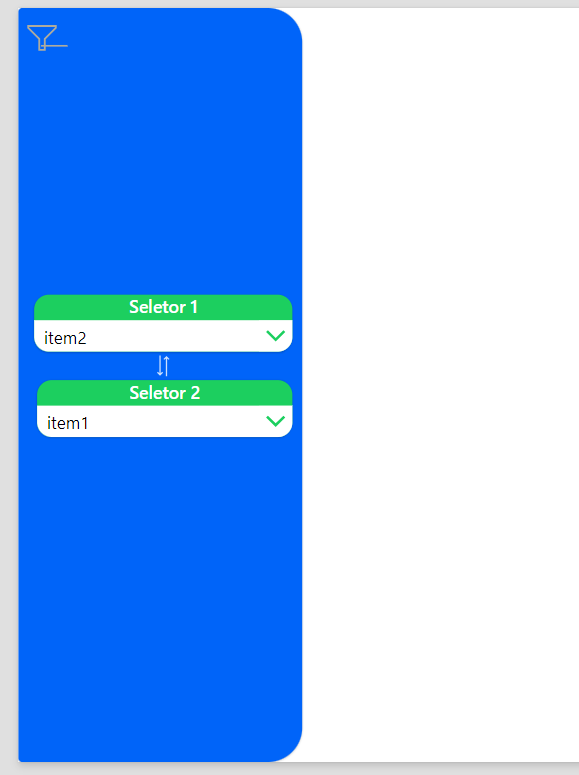

# Animated side menu
Este snippet YAML cria um campo de filtro personalizado no PowerApps. Ao clicar no botão, o campo de filtro aparece gradualmente, proporcionando uma experiência de transição suave e visualmente agradável, semelhante a um efeito de slide. Este recurso é ideal para melhorar a usabilidade e a estética da sua aplicação, permitindo que os usuários filtrem dados de forma intuitiva e eficiente

-   Filtro oculto
    - 
- Filtro sendo exibido
    - 
- Filtro completo
    - 

